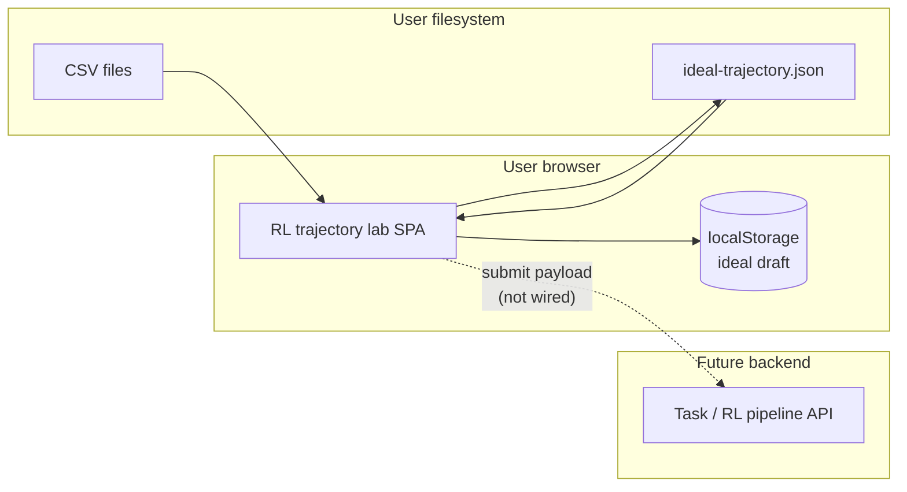
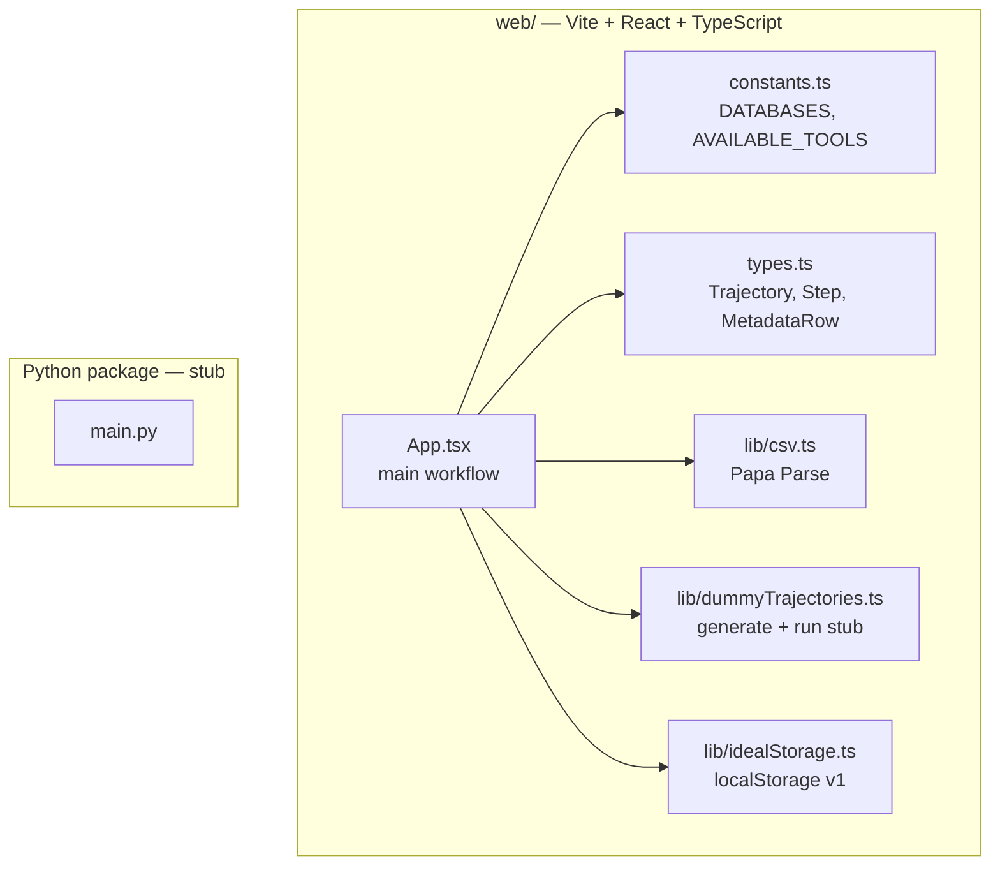
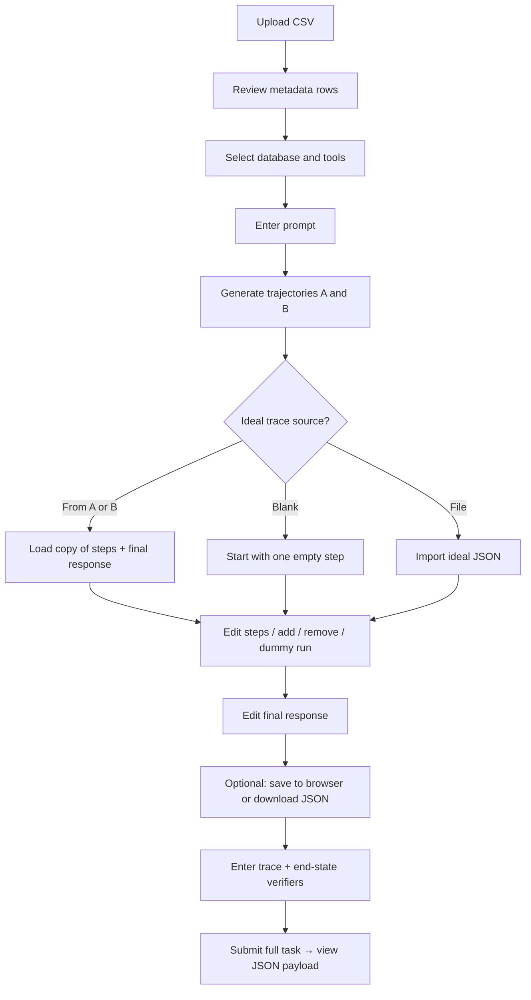
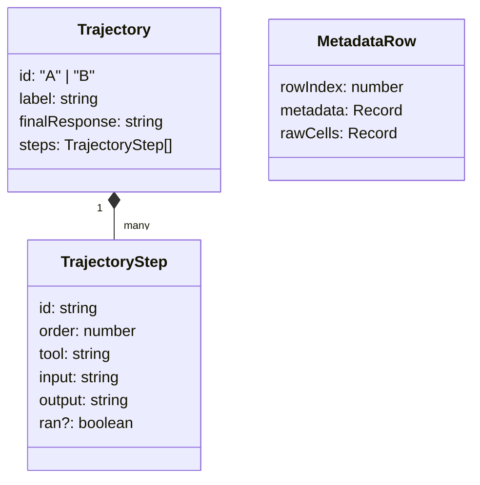
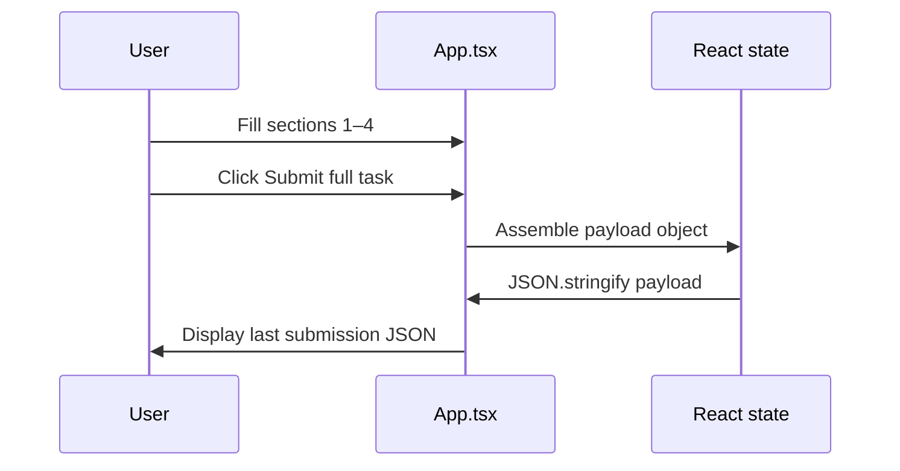

# RL Trajectory Lab — End-to-End Requirements

**Version:** 1.0  
**Product:** RL Platform — *RL trajectory lab* (web UI)  
**Codebase:** `rl-platform` — React (Vite) single-page app; Python package stub for future services.

This document describes the **functional and non-functional requirements** of the lab as implemented today, the **intended data model**, **user flows**, and **extension points** (e.g. replacing dummy generation with a real tool-calling model).

---

## 1. Vision and goals

### 1.1 Purpose

The **RL trajectory lab** is a browser-based workflow for **authoring and packaging reinforcement-learning (or preference-learning) task data** structured around:

- Per-row **metadata** (from CSV),
- A **task prompt** scoped to a **logical database** and **allowed tools**,
- Two comparable **trajectories** (A and B) that represent alternative agent runs,
- An **ideal (gold) trajectory** edited step-by-step,
- **Verifier** descriptions (trace-level and end-state), and
- A **single JSON payload** that aggregates everything for downstream training or evaluation.

Today, trajectory generation and per-step execution are **deterministic stubs** (“dummy”) so the lab can be used without a live LLM or backend.

### 1.2 Success criteria

| ID | Criterion |
|----|-----------|
| SC-1 | Annotators can load CSV metadata, configure prompt/db/tools, generate A/B trajectories, and refine an ideal trace in one session. |
| SC-2 | Ideal traces can be **saved to the browser**, **exported as JSON**, and **imported** for continuity across sessions or machines (file-based). |
| SC-3 | Submit produces a **stable, documented JSON shape** suitable for pipelines or API ingestion later. |
| SC-4 | The UI clearly communicates that generation is **dummy** until a real model is integrated. |

---

## 2. Personas and scope

### 2.1 Primary users

- **Task author / annotator:** Builds prompts, compares trajectories, writes the gold trace and verifiers.
- **ML engineer (downstream):** Consumes exported/submitted JSON for RL, DPO, or evaluation harnesses.

### 2.2 In scope (current release)

- CSV upload and metadata preview.
- Prompt, database selection, multi-select tools.
- Dummy generation of trajectories A and B.
- Ideal trajectory editing: copy from A/B, blank start, add/remove/reorder steps (via add/remove UI), dummy “run step”, copy helpers, final response.
- Browser persistence of ideal draft (`localStorage`).
- Verifier text fields and client-side “submit” that materializes the full payload (displayed as JSON).
- Dark/light capable styling (Tailwind).

### 2.3 Out of scope (current release)

- Server-side persistence, authentication, or multi-user collaboration.
- Real LLM or live tool execution against databases.
- Automated execution of verifier rules (verifiers are **captured text** only).

---

## 3. High-level architecture

### 3.1 System context



### 3.2 Application structure



### 3.3 Technology stack

| Layer | Choice |
|-------|--------|
| UI | React 19, TypeScript, Vite |
| Styling | Tailwind CSS v4 |
| CSV | Papa Parse |
| Browser storage | `localStorage` key `rl-platform-ideal-v1` |
| Backend | None in-repo for the lab UI; `pyproject.toml` defines an empty Python 3.13 package |

---

## 4. User journey (end-to-end)



---

## 5. Functional requirements

### 5.1 CSV and metadata

| ID | Requirement |
|----|-------------|
| FR-1.1 | The user can upload a `.csv` file from the local machine. |
| FR-1.2 | Parsing uses **header row** semantics; empty lines are skipped. |
| FR-1.3 | If a column name matches (case-insensitive) `metadata`, `meta`, `json`, or `Meta`, its cell value is parsed as **JSON object** per row. Invalid JSON yields metadata containing `_parseError` and `_raw`. |
| FR-1.4 | If no dedicated metadata column exists, **non-empty cells** are merged into a flat metadata object; cell values that parse as JSON objects are **merged** into metadata. |
| FR-1.5 | The UI lists each row with **row index** and **metadata** preview (JSON). |
| FR-1.6 | Parse failures surface an **error message** to the user. |

### 5.2 Prompt, database, and tools

| ID | Requirement |
|----|-------------|
| FR-2.1 | The user selects exactly one **logical database** from a fixed catalog (`users_db`, `orders_db`, `inventory_db`, `analytics_db`). |
| FR-2.2 | The user **multi-selects** allowed tools from a fixed pool (`query_db`, `search_semantic`, `aggregate_stats`, `format_answer`, `validate_schema`, `fetch_external`). |
| FR-2.3 | The user enters a **free-text prompt** (multi-line). |
| FR-2.4 | **Generate trajectories A & B** creates two trajectories using the dummy generator (see §6). |

### 5.3 Dummy trajectories A and B

| ID | Requirement |
|----|-------------|
| FR-3.1 | Each trajectory has an **id** (`A` or `B`), **label**, **ordered steps**, and a **final response** string. |
| FR-3.2 | Step count is derived from selected tools: **between 2 and 4** steps, capped by available tool names; if **no tools** are selected, defaults to `query_db` and `format_answer`. |
| FR-3.3 | Trajectories differ in **stub text** (e.g. “Dummy A” vs “Dummy B”) while sharing structure. |
| FR-3.4 | The UI shows **final response** and a **short summary** of each step (tool name + truncated output). |

### 5.4 Ideal trajectory

| ID | Requirement |
|----|-------------|
| FR-4.1 | **Use trajectory A/B** copies steps and final response into an **editable ideal** (new ids, `ran` cleared). |
| FR-4.2 | **Start blank trace** initializes one blank step with default tool and JSON input including the selected `database`. |
| FR-4.3 | User can **add step at end**, **add step below** a step, or **remove** a step; step **order** is renumbered contiguously. |
| FR-4.4 | Each step is editable: **tool** (string), **input**, **output**. |
| FR-4.5 | **Run step (dummy)** appends simulated output and sets `ran`. |
| FR-4.6 | **Copy input / output / final response** uses the clipboard API (failures ignored). |
| FR-4.7 | **Save to browser** persists ideal to `localStorage` (schema version **1**). |
| FR-4.8 | **Restore from browser** loads saved draft; button disabled if no saved draft exists. |
| FR-4.9 | **Download JSON** exports ideal fields with `version: 1` and timestamp. |
| FR-4.10 | **Import JSON** loads `idealSteps`, `idealFinalResponse`, `idealSource` from file; invalid files are ignored. |
| FR-4.11 | UI shows **unsaved changes** vs **saved** state using a **fingerprint** of ideal content. |

### 5.5 Verifiers and submit

| ID | Requirement |
|----|-------------|
| FR-5.1 | **Trace verifier** and **End-state verifier** are free-text fields (guidance for future automated checks). |
| FR-5.2 | **Submit full task** builds a single object containing: `metadataRows`, `databaseId`, `selectedTools`, `prompt`, `trajectories` (or `null` if A/B not both present), `ideal`, `verifiers`, `submittedAt` ISO timestamp. |
| FR-5.3 | The last submission is shown as **formatted JSON** for copy/export workflows. |

---

## 6. Data model

### 6.1 Core types (conceptual)



### 6.2 Submission payload (normative shape)

When both trajectories exist, `trajectories` is an object with keys `A` and `B`. Otherwise it is `null`.

```json
{
  "metadataRows": [],
  "databaseId": "users_db",
  "selectedTools": ["query_db", "format_answer"],
  "prompt": "string",
  "trajectories": {
    "A": { "id": "A", "label": "...", "finalResponse": "...", "steps": [] },
    "B": { "id": "B", "label": "...", "finalResponse": "...", "steps": [] }
  },
  "ideal": {
    "source": "A",
    "steps": [],
    "finalResponse": "string"
  },
  "verifiers": {
    "trace": "string",
    "endState": "string"
  },
  "submittedAt": "2026-05-04T12:00:00.000Z"
}
```

### 6.3 Stored ideal (browser / file)

- **localStorage** value for key `rl-platform-ideal-v1`: `{ version: 1, savedAt, idealSource, idealSteps, idealFinalResponse }`.
- **Downloaded file** (`ideal-trajectory.json`): includes `version`, `savedAt`, and the same ideal fields.

---

## 7. Sequence: submit flow



---

## 8. Non-functional requirements

| ID | Category | Requirement |
|----|----------|-------------|
| NFR-1 | Performance | CSV parsing and UI updates remain responsive for typical annotation files (hundreds of rows); large previews may scroll within a max-height panel. |
| NFR-2 | Privacy | Ideal drafts in **localStorage** stay on-device; no telemetry is defined in this repo. |
| NFR-3 | Maintainability | Tool and database lists are **centralized** in `constants.ts` for easy extension. |
| NFR-4 | Replaceability | `generateDummyTrajectories` and `dummyRunStepOutput` are explicit **stubs** intended to be swapped for real model/tool calls. |
| NFR-5 | Accessibility | Forms use labels; full WCAG audit is out of scope for v1. |

---

## 9. Future requirements (backlog)

| ID | Enhancement |
|----|-------------|
| FB-1 | POST submission payload to a **backend API** with auth and idempotent task ids. |
| FB-2 | Replace dummy generator with **LLM + tool executor**; stream steps into A/B. |
| FB-3 | Parse verifiers into structured rules and **run checks** on ideal or sampled trajectories. |
| FB-4 | Python **dataset export** or Parquet writer aligned with the submission schema. |
| FB-5 | Row-level selection when CSV has many rows (currently all rows load into payload). |

---

## 10. Assumptions and constraints

- **Single-page app:** No routing; all behavior lives in one main component tree.
- **No server validation:** CSV and JSON import trust user-supplied files within browser sandbox rules.
- **Clipboard:** Requires a secure context for best behavior; failures are non-blocking.
- **Trajectory availability:** Submit can run without trajectories; payload sets `trajectories: null` if either A or B is missing.

---

## 11. Glossary

| Term | Meaning |
|------|---------|
| **Trajectory** | Ordered list of tool calls (inputs/outputs) plus a final natural-language response. |
| **Ideal trajectory** | Human-approved gold trace used as supervision or reference policy. |
| **Verifier** | Human-readable criteria for validating traces or final answers (not executed in v1). |
| **Dummy** | Placeholder logic that simulates A/B diversity and step runs without external IO. |

---

*This document reflects the `web/` application as of the repository layout: React SPA under `web/`, shared types in `web/src/types.ts`, and stub Python package at repo root.*
